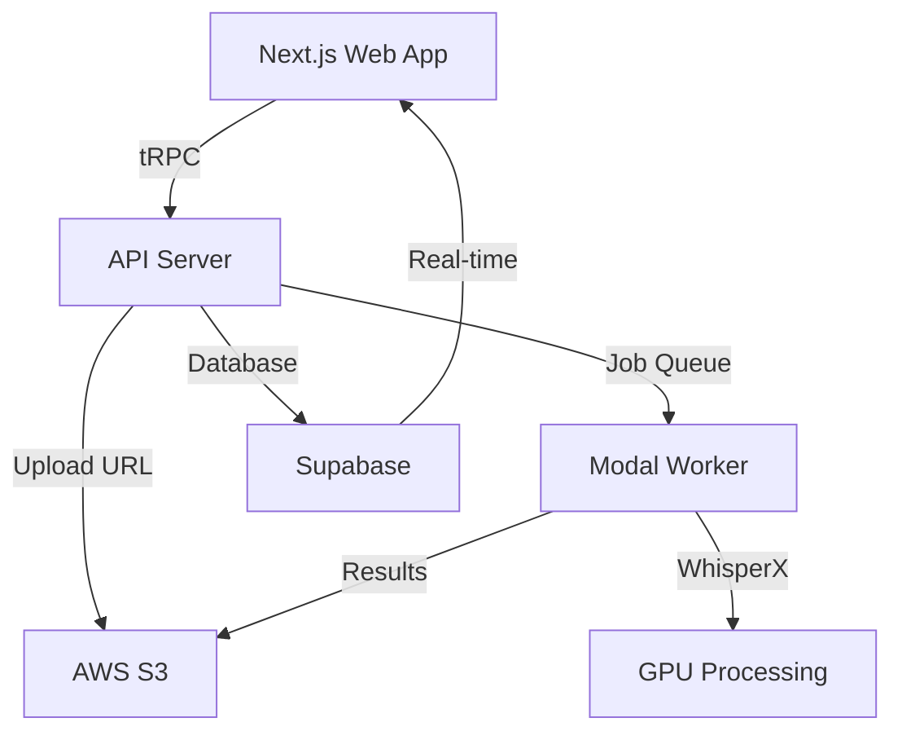

# 🎙️ Cloud Transcripts

<div align="center">
  
  
  
  
  
  
</div>

<p align="center">
  <strong>AI-powered video and audio transcription with speaker diarization</strong>
</p>

<p align="center">
  Upload your media files and get accurate transcripts with speaker identification, timestamps, and multiple export formats.
</p>

---

## ✨ Features

- 🎥 **Large File Support** - Upload videos and audio files up to 25GB
- 🤖 **AI Transcription** - Powered by WhisperX for accurate speech-to-text
- 👥 **Speaker Diarization** - Automatically identify and label different speakers
- ⚡ **Real-time Updates** - Track transcription progress with live status updates
- 📝 **Multiple Formats** - Export transcripts as Markdown or JSON
- ⏱️ **Word-level Timestamps** - Precise timing for each word
- 🔒 **Secure Storage** - Files stored securely in AWS S3
- 📱 **Responsive UI** - Beautiful interface that works on all devices

## 🏗️ Architecture

Cloud Transcripts is built with a modern, scalable architecture:



### Tech Stack

- **Frontend**: Next.js 15, React 19, TailwindCSS, tRPC
- **Backend**: Node.js, tRPC, Winston logging
- **Worker**: Python, Modal, WhisperX, PyTorch
- **Database**: Supabase (PostgreSQL)
- **Storage**: AWS S3
- **Infrastructure**: Terraform, Docker

## 🚀 Quick Start

### Prerequisites

- Node.js 18+ and npm
- Python 3.11+
- AWS account with S3 access
- Supabase account
- Modal account
- Hugging Face token (for speaker diarization)

### Installation

1. **Clone the repository**
   ```bash
   git clone https://github.com/yourusername/cloud-transcripts.git
   cd cloud-transcripts
   ```

2. **Install dependencies**
   ```bash
   npm install
   ```

3. **Set up environment variables**
   ```bash
   cp .env.example .env
   # Edit .env with your credentials
   ```

4. **Set up the database**
   ```bash
   # Apply Supabase migrations
   npx supabase migration up
   ```

5. **Deploy the Modal worker**
   ```bash
   modal deploy apps/worker/main.py
   ```

6. **Start the development server**
   ```bash
   npm run dev
   ```

7. **Open the app**
   ```
   http://localhost:3000
   ```

## 📖 Documentation

Detailed documentation is available in the [`docs/`](./docs) directory:

- [Architecture Overview](./docs/architecture.md)
- [Setup Guide](./docs/setup.md)
- [API Documentation](./docs/api.md)
- [Worker Documentation](./docs/worker.md)
- [Database Schema](./docs/database.md)
- [Deployment Guide](./docs/deployment.md)
- [Contributing Guidelines](./docs/contributing.md)

## 🔧 Configuration

### Environment Variables

See [`.env.example`](./.env.example) for all required environment variables:

- **Supabase**: Database and authentication
- **AWS S3**: File storage
- **Modal**: GPU worker deployment
- **Hugging Face**: Speaker diarization models

### Supported File Formats

- **Video**: MP4, MOV, MKV
- **Audio**: WAV, MP3

## 📝 Usage

1. **Upload a file**: Drag and drop or click to upload your media file
2. **Monitor progress**: Watch real-time updates as your file is processed
3. **View transcript**: See the formatted transcript with speaker labels
4. **Download**: Export as Markdown or JSON

## 🤝 Contributing

We welcome contributions! Please see our [Contributing Guidelines](./docs/contributing.md) for details.

## 📄 License

This project is licensed under the MIT License - see the [LICENSE](LICENSE) file for details.

## 🙏 Acknowledgments

- [WhisperX](https://github.com/m-bain/whisperX) for transcription
- [Modal](https://modal.com) for GPU infrastructure
- [Supabase](https://supabase.com) for database and real-time features
- [Vercel](https://vercel.com) for hosting inspiration

---

<p align="center">
  Made with ❤️ by the Cloud Transcripts team
</p> 