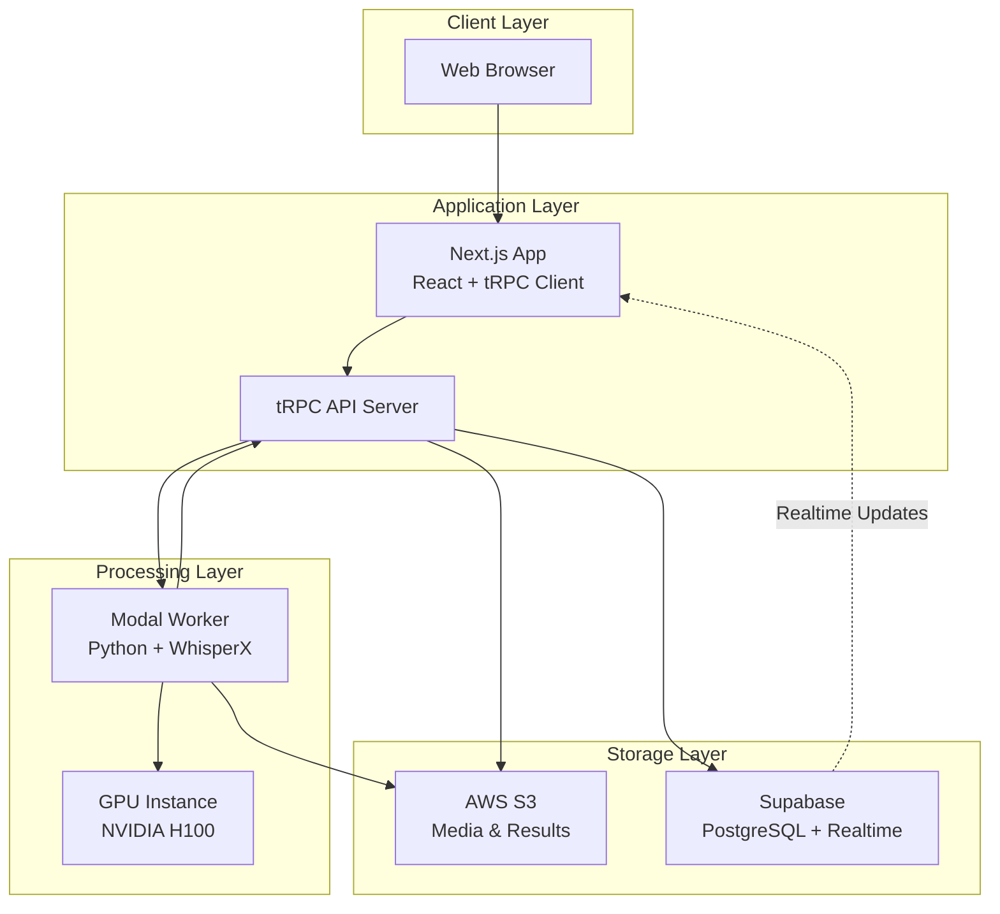

# Architecture Overview

## System Design

Cloud Transcripts is designed as a distributed, scalable system for processing large media files with AI-powered transcription. The architecture separates concerns between the web interface, API layer, processing workers, and storage systems.

## Components

### 1. Frontend (Next.js Web App)

The frontend is built with Next.js 15 and provides:

- **File Upload Interface**: React Dropzone for drag-and-drop uploads
- **Real-time Updates**: Supabase subscriptions for live job status
- **Transcript Viewer**: Markdown rendering with speaker labels
- **Responsive Design**: TailwindCSS with mobile-first approach

Key technologies:
- Next.js 15 with App Router
- React 19
- tRPC for type-safe API calls
- TanStack Query for data fetching
- TailwindCSS for styling

### 2. API Server (tRPC)

The API layer handles:

- **Authentication**: Optional user authentication via Supabase Auth
- **File Management**: Presigned URL generation for S3 uploads
- **Job Orchestration**: Creating and managing transcription jobs
- **Data Access**: CRUD operations for videos and transcripts

Key features:
- Type-safe API with tRPC
- Structured logging with Winston
- Rate limiting for public endpoints
- Correlation IDs for request tracing

### 3. Processing Worker (Modal)

The GPU-powered worker performs:

- **Audio Extraction**: FFmpeg for extracting audio from video
- **Transcription**: WhisperX for speech-to-text
- **Speaker Diarization**: Pyannote for speaker identification
- **Result Generation**: Markdown and JSON output formats

Infrastructure:
- Modal serverless GPU platform
- NVIDIA H100 GPUs
- Auto-scaling based on demand
- 6-hour timeout for long videos

### 4. Storage Systems

#### AWS S3
- **Input Files**: User-uploaded videos/audio
- **Output Files**: Generated transcripts (MD/JSON)
- **Organization**: Date-based folder structure
- **Security**: Presigned URLs with expiration

#### Supabase (PostgreSQL)
- **Videos Table**: Job metadata and status
- **Transcripts Table**: References to S3 files
- **Real-time**: PostgreSQL changes streamed to clients
- **RLS**: Row-level security for multi-tenancy

## Data Flow

### Upload Flow

1. User selects file in web interface
2. Frontend requests presigned upload URL from API
3. API generates S3 presigned URL (24-hour expiry)
4. Frontend uploads directly to S3
5. Frontend creates job via API
6. API creates database record and enqueues Modal job
7. User redirected to job status page

### Processing Flow

1. Modal worker receives job from queue
2. Downloads media file from S3
3. Extracts audio (if video input)
4. Runs WhisperX transcription
5. Performs speaker diarization (if enabled)
6. Generates Markdown and JSON outputs
7. Uploads results to S3
8. Sends webhook to update job status
9. Database update triggers real-time notification

### Viewing Flow

1. User navigates to transcript page
2. API generates presigned download URL
3. Frontend fetches and renders Markdown
4. User can download in multiple formats

## Security Considerations

### Authentication & Authorization
- Optional Supabase Auth integration
- Anonymous uploads supported
- User-owned resources protected by RLS

### Data Security
- All S3 operations use presigned URLs
- Webhook signatures for Modal callbacks
- Service role for system operations

### Rate Limiting
- Upload size limits (25GB)
- API rate limiting per IP
- Concurrent job limits

## Scalability

### Horizontal Scaling
- **Frontend**: Deploy to Vercel/Netlify edge network
- **API**: Multiple Next.js instances behind load balancer
- **Workers**: Modal auto-scales GPU instances
- **Database**: Supabase handles scaling

### Performance Optimizations
- Direct S3 uploads (bypass API for large files)
- Chunked file uploads for reliability
- CDN for static assets
- Database indexes on frequently queried fields

## Monitoring & Observability

### Logging
- Structured JSON logs with Winston
- Correlation IDs across services
- Log aggregation to CloudWatch/Datadog

### Metrics
- Job processing times
- Success/failure rates
- Queue depths
- API response times

### Alerts
- Failed job notifications
- High error rates
- Queue backlog warnings
- Storage quota alerts

## Technology Choices Rationale

### Why Modal?
- Serverless GPU infrastructure
- No need to manage GPU instances
- Built-in job queue and monitoring
- Cost-effective for variable workloads

### Why Supabase?
- Managed PostgreSQL with real-time
- Built-in authentication
- Row-level security
- Open source alternative to Firebase

### Why tRPC?
- End-to-end type safety
- No API schema duplication
- Excellent developer experience
- Native TypeScript support

### Why WhisperX?
- State-of-the-art transcription accuracy
- Word-level timestamps
- Built-in VAD (Voice Activity Detection)
- Supports speaker diarization 