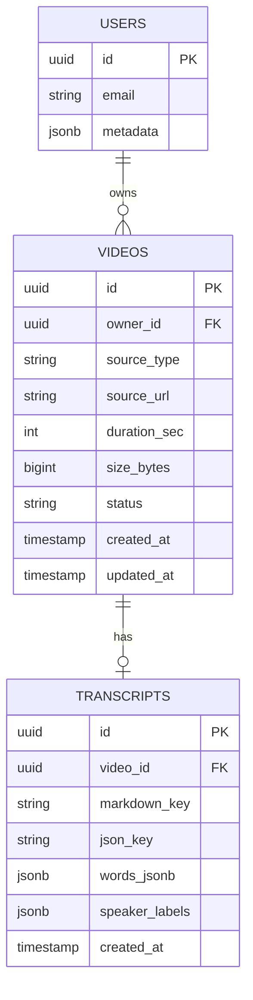

# Database Schema

Cloud Transcripts uses Supabase (PostgreSQL) as its primary database. The schema is designed for scalability, security, and real-time capabilities.

## Overview

The database consists of two main tables:
- **videos**: Stores transcription job metadata
- **transcripts**: Stores references to transcript files

## Entity Relationship Diagram



## Tables

### videos

Stores metadata about uploaded videos/audio files and their processing status.

| Column | Type | Constraints | Description |
|--------|------|-------------|-------------|
| id | uuid | PRIMARY KEY, DEFAULT gen_random_uuid() | Unique identifier |
| owner_id | uuid | REFERENCES auth.users(id), NULLABLE | User who owns the video (null for anonymous) |
| source_type | text | CHECK (upload, youtube) | Source of the media file |
| source_url | text | NULLABLE | S3 key for uploads or YouTube URL |
| duration_sec | integer | NULLABLE | Duration in seconds |
| size_bytes | bigint | NULLABLE | File size in bytes |
| status | text | CHECK (queued, processing, done, error) | Current job status |
| created_at | timestamptz | DEFAULT now() | Creation timestamp |
| updated_at | timestamptz | DEFAULT now() | Last update timestamp |

**Indexes:**
- `idx_videos_owner_id` on `owner_id`
- `idx_videos_status` on `status`

**Triggers:**
- `update_videos_updated_at`: Updates `updated_at` on row modification

### transcripts

Stores transcript data and references to generated files.

| Column | Type | Constraints | Description |
|--------|------|-------------|-------------|
| id | uuid | PRIMARY KEY, DEFAULT gen_random_uuid() | Unique identifier |
| video_id | uuid | REFERENCES videos(id) ON DELETE CASCADE | Associated video |
| markdown_key | text | NULLABLE | S3 key for Markdown file |
| json_key | text | NULLABLE | S3 key for JSON file |
| words_jsonb | jsonb | NULLABLE | Word-level timing data |
| speaker_labels | jsonb | NULLABLE | Speaker ID to name mapping |
| created_at | timestamptz | DEFAULT now() | Creation timestamp |

**Indexes:**
- `idx_transcripts_video_id` on `video_id`

## Row Level Security (RLS)

RLS is enabled on both tables to provide multi-tenant isolation.

### videos Table Policies

#### anon_create_videos
- **Operation**: INSERT
- **Check**: Always true
- **Purpose**: Allow anonymous users to create videos

#### view_own_or_anon_videos
- **Operation**: SELECT
- **Using**: `owner_id IS NULL OR owner_id = auth.uid()`
- **Purpose**: Users can view their own videos or anonymous videos

#### update_own_videos
- **Operation**: UPDATE
- **Using**: `owner_id = auth.uid()`
- **Check**: `owner_id = auth.uid()`
- **Purpose**: Users can only update their own videos

#### service_role_all_videos
- **Operation**: ALL
- **Using**: `auth.role() = 'service_role'`
- **Purpose**: Service role has full access (for webhooks)

### transcripts Table Policies

#### view_allowed_transcripts
- **Operation**: SELECT
- **Using**: Subquery checking video ownership
- **Purpose**: View transcripts for accessible videos

#### update_own_transcripts
- **Operation**: UPDATE
- **Using**: Subquery checking video ownership
- **Purpose**: Update transcripts for owned videos

#### service_role_all_transcripts
- **Operation**: ALL
- **Using**: `auth.role() = 'service_role'`
- **Purpose**: Service role has full access

## Data Types

### Status Enum
```sql
CHECK (status IN ('queued', 'processing', 'done', 'error'))
```

### Source Type Enum
```sql
CHECK (source_type IN ('upload', 'youtube'))
```

### Speaker Labels Format
```json
{
  "SPEAKER_00": "John Smith",
  "SPEAKER_01": "Jane Doe",
  "SPEAKER_02": "Interviewer"
}
```

### Words JSONB Format
```json
[
  {
    "text": "Hello",
    "start": 0.0,
    "end": 0.5,
    "speaker": "SPEAKER_00"
  },
  {
    "text": "world",
    "start": 0.5,
    "end": 1.0,
    "speaker": "SPEAKER_00"
  }
]
```

## Views

### v_videos

Real-time compatible view for video updates.

```sql
CREATE OR REPLACE VIEW public.v_videos AS
  SELECT 
    id,
    owner_id,
    source_type,
    source_url,
    duration_sec,
    size_bytes,
    status,
    created_at,
    updated_at
  FROM public.videos;
```

## Functions

### update_updated_at_column()

Automatically updates the `updated_at` timestamp.

```sql
CREATE OR REPLACE FUNCTION update_updated_at_column()
RETURNS TRIGGER AS $$
BEGIN
  NEW.updated_at = now();
  RETURN NEW;
END;
$$ language 'plpgsql';
```

## Migrations

Migrations are stored in `infra/supabase/migrations/` and applied in order.

### Running Migrations

Using Supabase CLI:
```bash
supabase db push
```

Or manually in SQL Editor:
```sql
-- Run contents of migration files
```

## Real-time Subscriptions

Supabase provides real-time updates via PostgreSQL's replication features.

### Subscribe to Job Updates

```typescript
const channel = supabase
  .channel('job-updates')
  .on(
    'postgres_changes',
    {
      event: 'UPDATE',
      schema: 'public',
      table: 'videos',
      filter: `id=eq.${jobId}`
    },
    (payload) => {
      console.log('Job updated:', payload.new)
    }
  )
  .subscribe()
```

### Subscribe to New Transcripts

```typescript
const channel = supabase
  .channel('new-transcripts')
  .on(
    'postgres_changes',
    {
      event: 'INSERT',
      schema: 'public',
      table: 'transcripts'
    },
    (payload) => {
      console.log('New transcript:', payload.new)
    }
  )
  .subscribe()
```

## Performance Considerations

### Indexes
- Index on `owner_id` for user queries
- Index on `status` for job monitoring
- Index on `video_id` for transcript lookups

### Query Optimization
- Use `select()` with specific columns
- Limit results with `.limit()`
- Use proper filtering to leverage indexes

### Connection Pooling
- Supabase handles connection pooling
- Use single client instance per request
- Close real-time channels when done

## Backup and Recovery

### Automatic Backups
- Supabase provides daily backups
- Point-in-time recovery available
- Backups retained for 30 days

### Manual Backup
```bash
# Export schema
supabase db dump -f schema.sql

# Export data
supabase db dump --data-only -f data.sql
```

### Restore
```bash
# Restore schema
psql $DATABASE_URL < schema.sql

# Restore data
psql $DATABASE_URL < data.sql
```

## Security Best Practices

### Authentication
- Use Supabase Auth for user management
- Service role key only for server-side operations
- Anon key for client-side with RLS

### Data Protection
- RLS policies enforce access control
- No direct database access from client
- Sensitive data stays in S3, not database

### API Keys
- Rotate service keys regularly
- Use environment variables
- Never commit keys to version control

## Monitoring

### Query Performance
```sql
-- Slow queries
SELECT query, calls, mean_time
FROM pg_stat_statements
WHERE mean_time > 100
ORDER BY mean_time DESC;
```

### Table Statistics
```sql
-- Table sizes
SELECT 
  schemaname,
  tablename,
  pg_size_pretty(pg_total_relation_size(schemaname||'.'||tablename)) as size
FROM pg_tables
WHERE schemaname = 'public'
ORDER BY pg_total_relation_size(schemaname||'.'||tablename) DESC;
```

### Active Connections
```sql
-- Current connections
SELECT count(*) FROM pg_stat_activity;
``` 