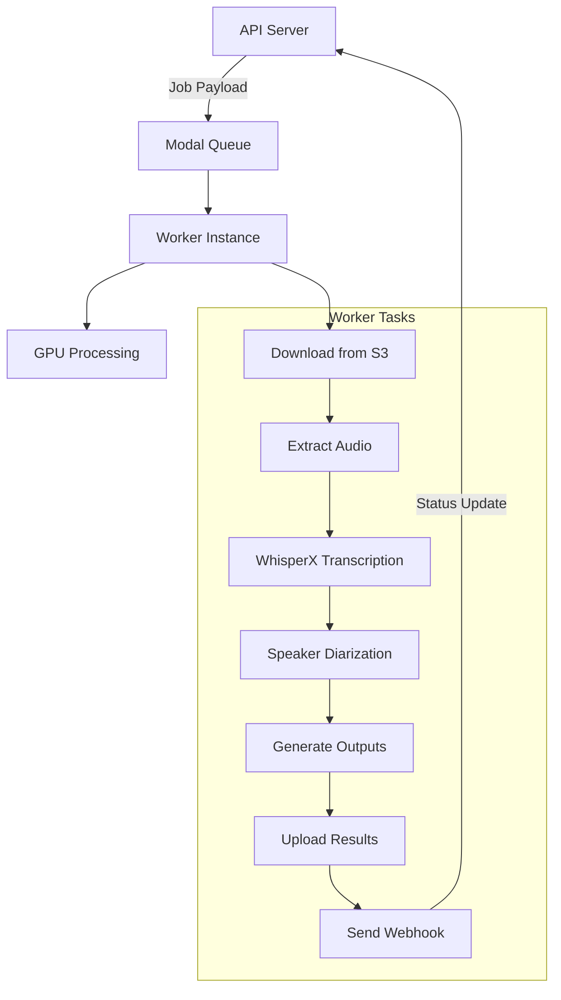

# Worker Documentation

The Cloud Transcripts worker is a Python-based GPU application that runs on [Modal](https://modal.com) to perform AI-powered transcription using WhisperX.

## Overview

The worker handles:
- Downloading media files from S3
- Extracting audio from video files
- Running WhisperX transcription
- Performing speaker diarization
- Generating output formats (Markdown, JSON)
- Uploading results back to S3
- Sending webhook notifications

## Architecture



## Worker Configuration

### Environment

```python
# GPU Configuration
GPU_TYPE = "H100"  # NVIDIA H100 for fast processing
TIMEOUT = 60 * 60 * 6  # 6-hour timeout

# Docker Image
Base: nvidia/cuda:12.1.1-cudnn8-runtime-ubuntu22.04
Python: 3.11
```

### Dependencies

- **PyTorch**: CUDA-optimized version for GPU acceleration
- **WhisperX**: Advanced transcription with word-level timestamps
- **Pyannote**: Speaker diarization pipeline
- **FFmpeg**: Audio/video processing
- **Boto3**: AWS S3 operations

## Job Processing Flow

### 1. Job Reception

The worker receives jobs via the `/enqueue` endpoint:

```python
@app.function()
@modal.fastapi_endpoint(method="POST")
async def enqueue(request: Request):
    # Parse job payload
    job_data = json.loads(await request.body())
    
    # Spawn async GPU task
    transcribe_task.spawn(json.dumps(job_data))
    
    return {"status": "queued", "job_id": job_id}, 202
```

### 2. Media Processing

#### Download from S3
```python
def download_from_s3(bucket: str, key: str, out: Path):
    s3 = get_s3()
    s3.download_file(bucket, key, str(out))
```

#### Audio Extraction
```python
def extract_audio(video_path: Path, wav_path: Path):
    # Check for audio stream
    if not has_audio_stream(video_path):
        raise ValueError("No audio track found")
    
    # Extract mono 16kHz WAV
    subprocess.run([
        "ffmpeg", "-i", str(video_path),
        "-vn", "-acodec", "pcm_s16le",
        "-ar", "16000", "-ac", "1",
        str(wav_path), "-y"
    ])
```

### 3. Transcription Pipeline

#### WhisperX Configuration
```python
# Load model
model = whisperx.load_model(
    model_size,      # tiny/base/small/medium/large/large-v2
    device="cuda",
    compute_type="float16"
)

# Transcribe
result = model.transcribe(
    str(wav_path),
    language=language  # ISO language code
)
```

#### Word Alignment
```python
# Load alignment model
align_model, metadata = whisperx.load_align_model(
    language_code=language,
    device="cuda"
)

# Align words
result = whisperx.align(
    result["segments"],
    align_model,
    metadata,
    str(wav_path),
    device="cuda"
)
```

### 4. Speaker Diarization

When enabled, the worker identifies different speakers:

```python
# Initialize diarization
diarize_model = DiarizationPipeline(
    use_auth_token=hf_token,
    device="cuda"
)

# Run diarization
diarize_segments = diarize_model(
    str(wav_path),
    min_speakers=min_speakers,  # Default: 2
    max_speakers=max_speakers   # Default: 6
)

# Assign speakers to words
result = whisperx.assign_word_speakers(
    diarize_segments,
    result
)
```

## Output Generation

### Markdown Format

The worker generates structured Markdown with:

1. **Full Transcript**: Continuous text grouped by speaker
2. **Timestamped Segments**: Detailed view with timestamps
3. **Word-level Timestamps**: Individual word timing

Example output structure:
```markdown
# Full Transcript

**SPEAKER_00:** Hello, welcome to today's interview...

**SPEAKER_01:** Thank you for having me...

# Timestamped Transcript

## Segment 1: [00:00:00 - 00:00:05] (SPEAKER_00)

Hello, welcome to today's interview.

### Word-level timestamps

**SPEAKER_00:**
- Hello @ 00:00:00
- welcome @ 00:00:01
- to @ 00:00:02
...
```

### JSON Format

Complete transcription data including:
- Segments with start/end times
- Word-level data with speaker assignments
- Metadata (language, duration, etc.)

## Error Handling

### Retry Logic

Critical operations use exponential backoff:

```python
@retry(
    stop=stop_after_attempt(5),
    wait=wait_exponential(multiplier=2, min=2, max=30)
)
def send_webhook(payload: dict, job_id: str):
    # Webhook with automatic retry
```

### Error Recovery

1. **Missing Audio Stream**: Clear error message
2. **Transcription Failure**: Fallback to basic mode
3. **Diarization Failure**: Continue without speakers
4. **S3 Errors**: Retry with backoff
5. **Webhook Failure**: Multiple retry attempts

### Error Reporting

All errors are:
- Logged with full context
- Sent via webhook to update job status
- Include traceback for debugging

## Logging

Structured JSON logging for observability:

```python
def log_info(message, **kwargs):
    log_data = {
        "level": "info",
        "message": message,
        "timestamp": time.time(),
        **kwargs
    }
    print(f"[INFO] {json.dumps(log_data)}")
```

Log levels:
- **INFO**: Normal operations
- **DEBUG**: Detailed processing steps
- **WARNING**: Recoverable issues
- **ERROR**: Failures with context

## Performance Optimization

### GPU Utilization
- Float16 precision for faster inference
- Batch processing where possible
- CUDA-optimized models

### Memory Management
- Temporary directory cleanup
- Streaming for large files
- Model unloading after use

### Concurrency
- Async job spawning
- Non-blocking webhook calls
- Parallel S3 operations

## Monitoring

### Metrics Tracked
- Job processing time
- Model inference duration
- File sizes processed
- Success/failure rates

### Health Checks
- GPU availability
- S3 connectivity
- Model loading success
- Disk space monitoring

## Configuration

### Required Secrets

Set in Modal dashboard as `transcript-worker-secret`:

```env
# AWS Credentials
AWS_ACCESS_KEY_ID=xxx
AWS_SECRET_ACCESS_KEY=xxx
AWS_DEFAULT_REGION=us-east-1

# Hugging Face (for diarization)
HF_TOKEN=hf_xxx

# Webhook
WEBHOOK_SECRET=xxx
WEBHOOK_URL=https://your-app.com/api/webhook/modal
```

### Model Selection

Available Whisper models:
- **tiny**: Fastest, lowest accuracy
- **base**: Good for testing
- **small**: Balanced performance
- **medium**: Good accuracy
- **large**: Best accuracy
- **large-v2**: Latest, most accurate

### Language Support

Supports all Whisper languages:
- English (en)
- Spanish (es)
- French (fr)
- German (de)
- Italian (it)
- Portuguese (pt)
- And 90+ more

## Deployment

### Deploy Command
```bash
modal deploy apps/worker/main.py
```

### Update Worker
```bash
# Make changes to main.py
modal deploy apps/worker/main.py
```

### View Logs
```bash
modal logs transcript-worker
```

### Monitor Performance
- Modal dashboard: https://modal.com/apps
- View function invocations
- Check GPU utilization
- Monitor costs

## Troubleshooting

### Common Issues

1. **GPU Out of Memory**
   - Reduce batch size
   - Use smaller model
   - Process shorter segments

2. **Timeout Errors**
   - Check file duration
   - Optimize processing pipeline
   - Increase timeout limit

3. **Diarization Failures**
   - Verify HF_TOKEN is valid
   - Check speaker count parameters
   - Ensure audio quality

4. **S3 Access Denied**
   - Verify AWS credentials
   - Check bucket permissions
   - Confirm object keys

### Debug Mode

Enable verbose logging:
```python
# Set in Modal secrets
DEBUG=true
```

### Local Testing

Test worker locally:
```bash
# Install dependencies
pip install -r requirements.txt

# Run with Modal stub
modal run apps/worker/main.py
``` 